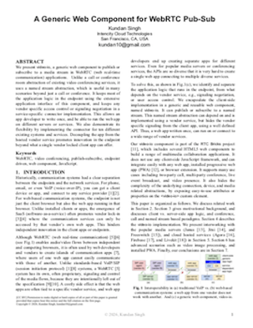
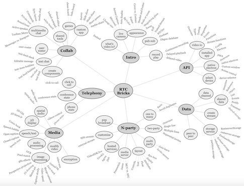

# RTC Bricks

This project aims to unleash WebRTC creativity using web components.
It has a collection of more than 70 web components for building a wide range of
real-time communication and collaboration web applications.

I started this project with one generic web component, &lt;video-io&gt;, 
for publish-subscribe in WebRTC apps. It has a simple video box 
abstraction that can be published or subscribed to a named stream.
The motivation, software architecture, implementation, and various 
connectors of &lt;video-io&gt; are presented in the research paper,
[A Generic Web Component for WebRTC Pub-Sub](https://arxiv.org/pdf/2602.22011).
In summary, it promotes reuse of media features across different
applications, reduces vendor lock-in of communication features, and
provides a flexible, extensible, secure, feature-rich, and end-point
driven web component to support a large number of communication
scenarios. A presentation and demonstration video, and the
complete comprehensive tutorial are also available below.

| Video Demonstration | Research paper |
|:-----:|:-----:|
|32 min| 11 pages |
|  |  |

| Complete tutorial |
|:-----:|
| 383 pages, 50MB |
|  |

As I worked through many sample and demo web apps using this
&lt;video-io&gt; component, I kept creating more abstractions and
web components, e.g., for layout of multiple video boxes,
or text chat, or speech transcription, or call signaling, and so on.
The collection will keep growing, and improving, as I work on more
application scenarios. But the basic foundational ideas or the theme of
this project remains the same, as follow:

 1. Separate any app logic from any user data.
 1. Keep the app logic in the endpoint, if possible.
 1. Use vanilla JavaScript, and avoid any client side framework.
 1. Create flexible and extensible interfaces in HTML5 web components.

## Getting Started

Please contact the software owner, or join the discussion group mentioned below,
to get started with this project. It is actually very easy to get started.
Just checkout the code, run a simple web server, and access the v1 directory
in a browwer. That will open the full tutorial to get started. 
I just use Python command like, `python -m SimpleHTTPServer`, from within the
rtcbricks directory, to launch a simple web server, to see the tutorial.

I have also hosted the tutorial on my website, at
[rtcbricks.kundansingh.com/v1](https://rtcbricks.kundansingh.com/v1/)
but this is access controlled. Please reach out to the project owner to get access,
if you can't run the tutorial on your local server.

<!-- Early ideas are in:
1. A generic video-io component for WebRTC [[HTML](https://blog.kundansingh.com/2019/06/a-generic-video-io-component-for-webrtc.html)]
2. SIP APIs for Voice and Video Communications on the Web [[PDF](https://arxiv.org/abs/1106.6333)]
3. Building Communicating Web Applications Leveraging Endpoints and Cloud Resource Service [[PDF](https://kundansingh.com/papers/2013-artisy-paper-private.pdf)] -->

# License, copyright and contributions

The core software is released under dual license: AGPL (GNU Affero General
Public License) as well as Alternative commercial license.
In summary, if you keep this software to yourself, or make your whole product or service open-source,
then AGPL is fine; if you want to sell your own software with pieces of this project inside, even
if you are offering software-as-a-service or a cloud hosted product, you'll likely need to buy the
alternative commercial license.

If you are interested in sponsoring this project, or hiring (contract work) for
integration with your system, please reach out to the owner by email, mentioned
below. You can also join the 
[project support and discussion group](https://groups.google.com/u/1/g/theintencity)
for all our projects.

Software owner is **Kundan Singh ([theintencity@gmail.com](mailto:theintencity@gmail.com))**.
All pieces of this software including source code, documentation, and binaries are copyright
protected as *&copy; 2026, Kundan Singh &lt;theintencity@gmail.com&gt;*.

Any contributions to this software such as in the form of pull request
or suggested changes that gets merged or included is this software,
automatically get the copyright and ownership transferred to the
original software owner mentioned above, and turn into the dual license
term mentioned here, to be compatible with the original software
license. This clause allows the software owner to continue to provide
the open source offering at the dual license terms, and benefits
everyone.
